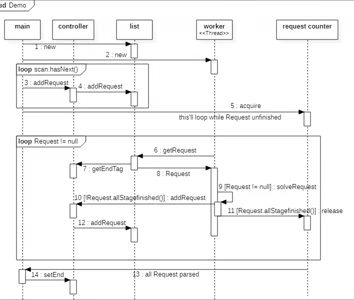

## 第四次研讨课课上答题卡

现在你们组分到了一份错误代码，可以用以下输入进行测试：

```java
FIRST:Welding-Polishing-Packing
SECOND:Welding-Polishing-Assembling-Packing
THIRD:Welding-Polishing-Assembling-Packing
```

正确的代码的运行流程图如下：（为了简化，图中仅有单个 list 单个 worker）



那么，你们小组分到的那一份代码，是在哪个流程出现了错误？请简述错误对代码运行所带来的影响，并简述正确代码运行的流程

（涉及到主线程以及单个 worker 线程即可）。

